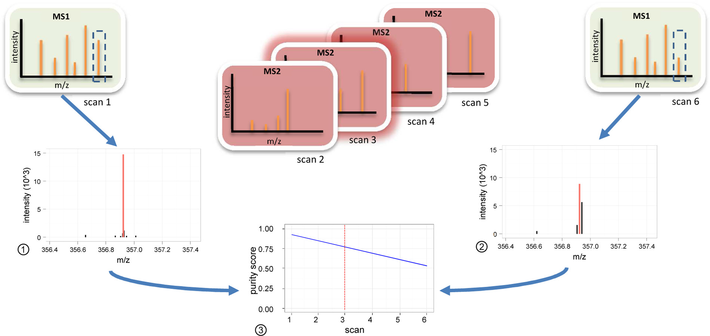
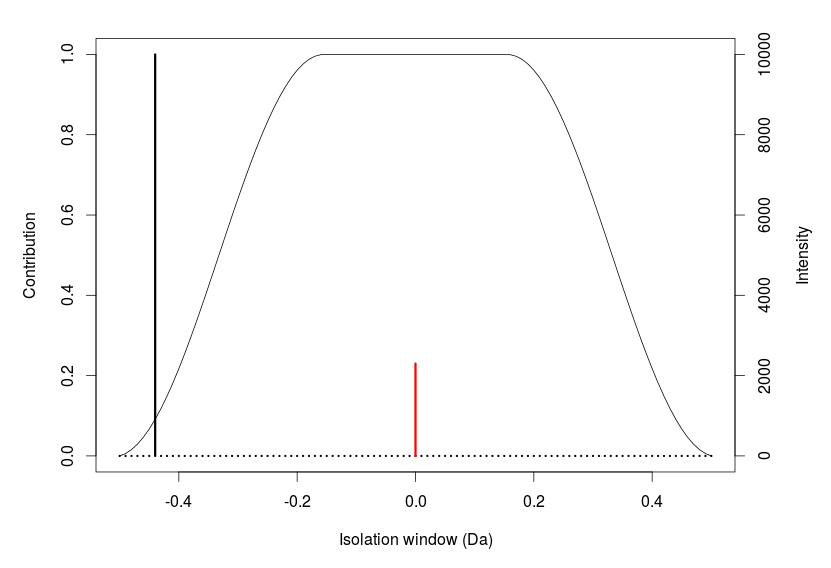
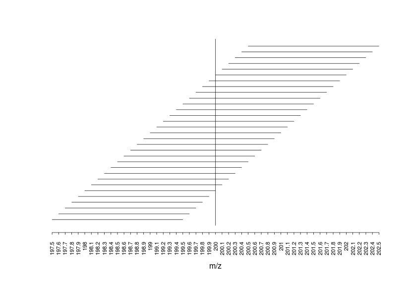
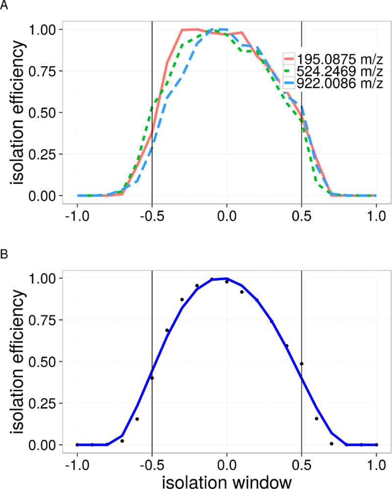
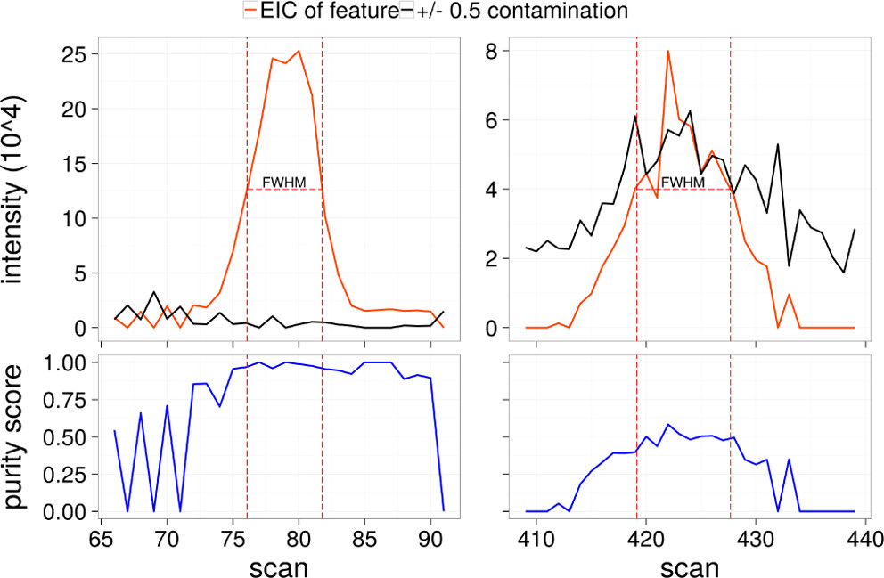

# Introduction

The msPurity R package was originally developed to assess the contribution of the targeted precursor in a fragmentation isolation window using a metric called "precursor ion purity". See associated paper  [@Lawson2017]. 

A number of updates have been made since the original paper and the full functionality of msPurity now includes the following:

* Assess the contribution of the targeted precursor of acquired fragmentation spectra by checking isolation windows using a metric called "precursor ion purity" (Works for both LC-MS(/MS) and DIMS(/MS) data)
* Assess the anticipated precursor ion purity of XCMS LC-MS features and DIMS features where no fragmentation has been acquired
* Map fragmentation spectra to XCMS LC-MS features
* Filter and average MS/MS spectra from an LC-MS/MS dataset
* Create a spectral-database of LC-MS(/MS) data and associated annotations
* Perform spectral matching of query MS/MS spectra against library MS/MS spectra
* Export fragmentation spectra to MSP format
* Basic processing of DIMS data. Note that these functionalities are not actively developed anymore - see DIMSpy (https://github.com/computational-metabolomics/dimspy) for recommended alternative for DIMS data processing


What we call "Precursor ion purity" is a measure of the contribution of a selected precursor peak in an isolation window used for fragmentation. The simple calculation involves dividing the intensity of the selected precursor peak by the total intensity of the isolation window. When assessing MS/MS spectra this calculation is done before and after the MS/MS scan of interest and the purity is interpolated at the time of the MS/MS acquisition. The calculation is  similar to the "Precursor Ion Fraction"" (PIF) metric described by [@Michalski2011] for proteomics with the exception that purity here is interpolated at the recorded point of MS/MS acquisition using bordering full-scan spectra. Additionally, low abundance ions that are remove that are thought to have limited contribution to the resulting MS/MS spectra and the isolation efficiency of the mass spectrometer can be used to normalise the contributing ions to metric.

There are 3 main classes used in msPurity

*  **purityA**
    + Assessing precursor purity of previously acquired MS/MS spectra: A user has acquired either LC-MS/MS or DIMS/MS spectra and an assessment is made of the precursor purity for each MS/MS scan
    + Further processing of the purityA object include - fragmentation spectra filtering, averaging, MSP creation, spectral-database creation and spectral matching
* **purityX**
    + Assessing precursor purity of anticipated isolation windows for LC-MS/MS spectra. i.e. a user has acquired from an LC-MS full scan (MS1) data and an assessment is to be made of the precursor purity of detected features using anticipated or theoretical isolation windows. This information can then be used to guide further targeted MS/MS experiments.
* **purityD**
    + Assessing precursor purity of anticipated isolation windows for DIMS/MS spectra.
    + Also provides some basic functionality to process DIMS spectra
  
# purityA

## Assessing precursor purity of previously acquired MS/MS spectra

Given a vector of LC-MS/MS or DIMS/MS mzML file paths the precursor ion purity of each MS/MS scan can be calculated and stored in the purityA S4 class object where a dataframe of the purity results can be accessed using the appropriate slot (`pa@puritydf`).

The calculation involves dividing the intensity of the selected precursor peak by the total intensity of the isolation window and is performed before and after the MS/MS scan of interest and interpolated at the recorded time of the MS/MS acquisition. See below 




Additionally, isotopic peaks can estimated and omitted from the calculation, low abundance peaks are removed that are thought to have limited contribution to the resulting MS/MS spectra and the isolation efficiency of the mass spectrometer can be used to normalise the intensities used for the calculation.

The purity dataframe (`pa@puritydf`) consists of the following columns:

* **pid**: unique id for MS/MS scan
* **fileid**: unique id for file
* **seqNum**: scan number
* **precursorIntensity**: precursor intensity value as defined from mzML file
* **precursorMZ**: precursor m/z value as defined from mzML file
* **precursorRT**: precursor RT value as defined from mzML file
* **precursorScanNum**: precursor scan number value as defined from mzML file
* **id**: unique id (redundant)
* **filename**: mzML filename
* **precursorNearest**: MS1 scan nearest to this MS/MS scan
* **aMz**: The m/z value in the precursorNearest scan which most closely matches the precursorMZ value provided from the mzML file
* **aPurity**: The purity score for **aMz**
* **apkNm**: The number of peaks in the isolation window for **aMz**
* **iMz**: The m/z value in the precursorNearest scan that is the most intense within the isolation window.
* **iPurity**: The purity score for **iMz**
* **ipkNm**: The number of peaks in the isolation window for **iMz**
* **inPurity**: The interpolated purity score
* **inpkNm**: The interpolated number of peaks in the isolation window

The remaining slots for purityA class include

* **cores**: The number of CPUs to be used for any further processing with this purityA object
* **fileList**: list of the files that have been processed
* **mzRback**: The backend library used by mzR to extract information from the mzML file (e.g. pwiz)
* **grped_df**: If frag4feature has been performed, a dataframe of the grouped XCMS features linked to the associated fragmentation spectra precursor * details is recorded here
* **grped_MS/MS**:  If frag4feature has been performed, a list of fragmentation spectra assoicated with each grouped XCMS feature is recorded here
* **f4f_link_type**: If frag4feature has been performed, the linking method is recorded here
* **av_spectra**: if averageIntraFragSpectra, averageInterFragSpectra,  or averageAllFragSpectra have been performed, the average spectra is recorded here
* **av_intra_params**:  If averageIntraFragSpectra has been performed, the parameters are recorded here
* **av_inter_params**: if averageInterFragSpectra has been performed, the  parameters are recorded here
* **av_all_params**: If averageAllFragSpectra has been performed, the parameters are recorded here
* **db_path**: If create_database has been performed, the resulting database path is recorded here


```r
library(msPurity)
mzMLpths <- list.files(system.file("extdata", "lcms", "mzML", package="msPurityData"), full.names = TRUE, pattern = "MSMS")
```

Note that if there are any mzML files that do not have MS/MS scans - then an ID is save of the file but no assessments will be made.


```r
pa <- purityA(mzMLpths)
print(pa@puritydf[1:3,])
```

```
##   pid fileid seqNum acquisitionNum precursorIntensity precursorMZ
## 1   1      1      7              7            2338044    391.2838
## 2   2      1      8              8            1415940    149.0232
## 3   3      1      9              9            1319700    135.1015
##   precursorRT precursorScanNum id      filename retentionTime
## 1    2.707016                6  7 LCMSMS_1.mzML      2.977597
## 2    2.707016                6  8 LCMSMS_1.mzML      3.070549
## 3    2.707016                6  9 LCMSMS_1.mzML      3.163231
##   precursorNearest      aMz   aPurity apkNm      iMz   iPurity ipkNm
## 1                6 391.2838 1.0000000     1 391.2838 1.0000000     1
## 2                6 149.0233 0.8535700     2 149.0233 0.8535700     2
## 3                6 135.1015 0.7616688     4 135.1015 0.7616688     4
##   inPkNm  inPurity
## 1      1 1.0000000
## 2      2 0.8475240
## 3      4 0.7558731
```

## Isolation efficiency

We define here "isolation efficiency"" as the effect of the position of an ion within an isolation window on its relative intensity in corresponding fragmentation spectra. When the isolation efficiency of an instrument is known, the peak intensities within an isolation window can be normalised for the precursor purity calculation. In the example in beloq, an R-Cosine isolation efficiency curve is used, the red peak (the targeted precursor ion peak) would not change following normalisation -  as the contribution is at 1 (i.e. 100%) - however the the black peak (a contaminating ion) would be normalised by approximately 0.1 (i.e. 10%) and the normalised intensity would be calculated as 1000 (i.e. original intensity of 10000 x 0.1)





The isolation efficiency can be estimated by looking at a single precursor with a sliding window - see below for an example deomonstrating a sliding window around a target m/z of 200. 



A sliding window experiment has been performed to assess Thermo Fisher Q-Exactive Mass spectrometer using 0.5 Da windows and can be set within msPurity by using msPurity::iwNormQE.5() as the input to the iwNormFunc argument. See below:




Other available options are to use gaussian isolation window msPurity::iwNormGauss(minOff=-0.5, maxOff = 0.5) or a R-Cosine window msPurity::iwNormRCosine(minOff=-0.5, maxOff=0.5). Where the minOff and maxOff can be changed depending on the isolation window. 

A user can also create their own normalisation function. The only requirement of the function is that given a value between the minOff and maxOff a normalisation value between 0-1 is returned.

Se below for example of using one of the default provided normalisation functions. 


```r
msmsPths <- list.files(system.file("extdata", "lcms", "mzML", package="msPurityData"), full.names = TRUE, pattern = "MSMS")
pa_norm <- purityA(msmsPths[1], iwNorm=TRUE, iwNormFun=iwNormGauss(sdlim=3, minOff=-0.5, maxOff=0.5))
```

If the isolation efficiency of the instrument is not known, by default iwNorm is set to FALSE and no normalisation will occur.


## frag4feature - mapping XCMS features to fragmentation spectra
First an xcmsSet object of the same files is required


```r
suppressPackageStartupMessages(library(xcms))

xset <- xcms::xcmsSet(mzMLpths)
xset <- xcms::group(xset)
```

Then the MS/MS spectra can be assigned to an XCMS grouped feature using the `frag4feature` function. 

```r
pa <- frag4feature(pa, xset)
```

The slot `grped_df` is a dataframe of the grouped XCMS features linked to a reference to any associated MS/MS scans in the region of the full width of the XCMS feature in each file. The dataframe contains the following columns.

* **grpid**: XCMS grouped feature id
* **mz**: derived from XCMS peaklist
* **mzmin**: derived from XCMS peaklist
* **mzmax**: derived from XCMS peaklist
* **rt**: derived from XCMS peaklist
* **rtmin**: derived from XCMS peaklist
* **rtmax**: derived from XCMS peaklist 
* **into**: derived from XCMS peaklist
* **intb**: derived from XCMS peaklist
* **maxo**: derived from XCMS peaklist
* **sn**: derived from XCMS peaklist
* **sample**: derived from XCMS peaklist
* **id**: unique id of MS/MS scan
* **precurMtchID**: Associated nearest precursor scan id (file specific)
* **precurMtchRT**: Associated precursor scan RT
* **precurMtchMZ**: Associated precursor _m/z_
* **precurMtchPPM**: Associated precursor _m/z_ parts per million (ppm) tolerance to XCMS feauture _m/z_
* **inPurity**: The interpolated purity score


```r
print(head(pa@grped_df[1:3]))
```

```
##   grpid       mz    mzmin
## 1     8 112.0509 112.0506
## 2     8 112.0508 112.0507
## 3    12 116.0706 116.0109
## 4    12 116.0706 116.0109
## 5    12 116.0706 116.0109
## 6    12 116.0706 116.0109
```

The slot `grped_MS2` is a list of the associated fragmentation spectra for the grouped features. 


```r
print(pa@grped_ms2[[1]])  # fragmentation associated with the first XCMS grouped feature (i.e. xset@groups[1,])
```

```
## [[1]]
##          [,1]       [,2]
## [1,] 112.0509 565117.250
## [2,] 126.5377   2499.315
## 
## [[2]]
##          [,1]     [,2]
## [1,] 112.0509 440629.7
```

## filterFragSpectra - filter the fragmentation spectra

Flag and filter features based on signal-to-noise ratio, relative abundance, intensity threshold and precursor ion purity of the precursor.


```r
pa <- filterFragSpectra(pa)
```


## averageAllFragSpectra - average all fragmentation spectra

Average and filter fragmentation spectra for each XCMS feature within and across MS data files (ignoring intra and inter relationships).


```r
pa <- averageAllFragSpectra(pa)
```

## averageIntraFragSpectra - average all fragmentation spectra

Average and filter fragmentation spectra for each XCMS feature within a MS data file.


```r
pa <- averageIntraFragSpectra(pa)
```

## averageInterFragSpectra - average all fragmentation spectra

Average and filter fragmentation spectra for each XCMS feature across MS data files. This can only be run after averageIntraFragSpectra has been used.


```r
pa <- averageInterFragSpectra(pa)
```


## createMSP - create an MSP file of the fragmentation spectra

Create an MSP file for all the fragmentation spectra that has been linked to an XCMS feature via frag4feature. Can export all the associated scans individually or the averaged fragmentation spectra can be exported.

Additional metadata can be included in a dataframe (each column will be added to metadata of the MSP spectra). The dataframe must contain the column "grpid" corresponding to the XCMS grouped feature.


```r
td <- tempdir()
createMSP(pa, msp_file_pth = file.path(td, 'out.msp'))
```


## createDatabase - create a spectral database

A database can be made of the LC-MS/MS dataset - this can then be udpated with the spectral matching data (from spectralMatching function). The full schema of the database is found [here](https://bioconductor.org/packages/release/bioc/vignettes/msPurity/inst/doc/msPurity-spectral-datatabase-schema.html). This replaces the old schema used by the deprecated function spectral_matching.


```r
q_dbPth <- createDatabase(pa, xset, outDir = td, dbName = 'test-mspurity-vignette.sqlite')
```

## spectralMatching - perfroming spectral matching to a spectral library

A query SQLite database can be matched against a library SQLite database with the spectralMatching function. The library spectral-database in most cases should contain the "known" spectra from either public or user generated resources. The library SQLite database by default contains data from MoNA including Massbank, HMDB, LipidBlast and GNPS. A larger database can be downloaded from [here](https://github.com/computational-metabolomics/msp2db/releases).


```r
result <- spectralMatching(q_dbPth, q_xcmsGroups = c(12, 27), cores=1, l_accessions=c('CCMSLIB00000577898','CE000616'))
```

```
## Running msPurity spectral matching function for LC-MS(/MS) data
```

```
## Filter query dataset
```

```
## Filter library dataset
```

```
## aligning and matching
```

```
## Summarising LC feature annotations
```


# purityX


## Assessing anticipated purity of XCMS features from an LC-MS run

NOTE ON TERMINOLOGY: The term 'anticipated purity' and 'predicted purity' are used interchangeably

A processed xcmsSet object is required to determine the anticipated (predicted) precursor purity score from an LC-MS dataset. The offsets chosen in the parameters should reflect what settings would be used in a hypothetical fragmentation experiment.



The slot `predictions` provides the anticipated (predicted) purity scores for each feature. The dataframe contains the following columns:

* **grpid**: XCMS grouped feature id
* **mean**: Mean predicted purity of the feature
* **median**: Median predicted purity of the feature
* **sd**: Standard deviation of the predicted purity of the feature
* **stde**: Standard error of the predicted purity of the feature
* **pknm**: Median peak number in isolation window
* **RSD**: Relative standard deviation of the predicted purity of the feature
* **i**: Median intensity of the grouped feature. Uses XCMS "into" intensity value.
* **mz**: _m/z_ of the XCMS grouped feature

_XCMS run on an LC-MS dataset_

```r
msPths <- list.files(system.file("extdata", "lcms", "mzML", package="msPurityData"), full.names = TRUE, pattern = "LCMS_")

#Run xcms
#xset <- xcmsSet(msPths)
#xset <- group(xset)

# Or load an XCMS xcmsSet object saved earlier
xset <- readRDS(system.file("extdata", "tests", "xcms", "ms_only_xset.rds", package="msPurity"))
# Make sure the file paths are correct
xset@filepaths[1] <- msPths[basename(msPths)=="LCMS_1.mzML"]
xset@filepaths[2] <- msPths[basename(msPths)=="LCMS_2.mzML"]
```

_Perform purity calculations_

```r
px <- purityX(xset, cores = 1, xgroups = c(1, 2), ilim=0)
```


# purityD

## Assessing anticipated purity from a DIMS run

The anticipated/predicted purity for a DIMS experiment can be performed on any DIMS dataset consisting of multiple MS1 scans of the same mass range, i.e. it has **not** been developed to be used with any SIM stitching approach.

A number of simple data processing steps are performed on the mzML files to provide a DIMS peak list (features) to perform the purity predictions on. 

These data processing steps consist of:

* Averaging peaks across multiple scans 
* Removing peaks below a signal to noise threshold [optional]
* Removing peaks less than an intensity threshold [optional]
* Removing peaks above a RSD threshold for intensity [optional]
* Where there is a blank, subtracting blank peaks [optional]

The averaged peaks before and after filtering are stored in the `avPeaks` slot of purityPD S4 object.


**Get file dataframe**:
The purityD constructor requires a dataframe consisting of the following columns:

* filepth
* name
* sampleType [either sample or blank]
* class [for grouping samples together]
* polarity [optional]


```r
datapth <- system.file("extdata", "dims", "mzML", package="msPurityData")
inDF <- Getfiles(datapth, pattern=".mzML", check = FALSE)
ppDIMS <- purityD(inDF, mzML=TRUE)
```

**Average spectra**:
The default averaging will use a Hierarchal clustering approach. Noise filtering is also performed here.


```r
ppDIMS <- averageSpectra(ppDIMS, snMeth = "median", snthr = 5)
```

**Filter by RSD and Intensity**

```r
ppDIMS <- filterp(ppDIMS, thr=5000, rsd = 10)
```

**Subtract blank**

```r
ppDIMS <- subtract(ppDIMS)
```

**Predict purity**

```r
ppDIMS <- dimsPredictPurity(ppDIMS)

print(head(ppDIMS@avPeaks$processed$B02_Daph_TEST_pos))
```

```
##    peakID       mz          i        snr      rsd        inorm count total
## 5       5 173.0806 11272447.0 216.506319 9.006126 0.0108585920     5     4
## 7       7 179.1177   606983.2  11.425825 6.019861 0.0005729283     5     4
## 10     10 217.1067 17770220.0 343.292914 8.602331 0.0171178067     5     4
## 15     15 235.1173  4950841.5  95.991762 6.302825 0.0047694791     5     4
## 16     16 236.1206   486912.0   9.270517 8.811437 0.0004638254     5     4
## 17     17 239.1485  2533134.5  48.892062 5.781277 0.0024401334     5     4
##    medianPurity meanPurity   sdPurity cvPurity   sdePurity medianPeakNum
## 5     1.0000000  1.0000000 0.00000000 0.000000 0.000000000             1
## 7     1.0000000  1.0000000 0.00000000 0.000000 0.000000000             1
## 10    0.7797864  0.7808917 0.01261501 1.615462 0.005641605             2
## 15    1.0000000  1.0000000 0.00000000 0.000000 0.000000000             1
## 16    0.8818313  0.8755873 0.01056807 1.206969 0.004726184             2
## 17    0.8123950  0.8229505 0.04384595 5.327896 0.019608505             2
```


## Calculating the anticipated (predicted) purity from a known _m/z_ target list for DIMS

The data processing steps carried out through purityPD can be bypassed if the peaks (_m/z_ values) of interest are already known. The function `dimsPredictPuritySingle()` can be used to predict the purity of a list of _m/z_ values in a chosen mzML file.


```r
mzpth <- system.file("extdata", "dims", "mzML", "B02_Daph_TEST_pos.mzML", package="msPurityData")
predicted <- dimsPredictPuritySingle(filepth = mzpth, mztargets = c(111.0436, 113.1069))
print(predicted)
```


# References

